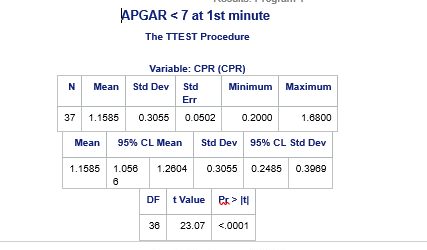
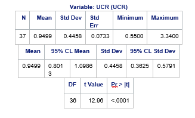
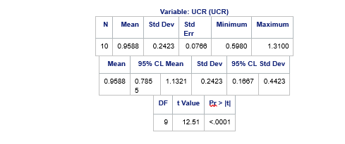

# SAS-project
## Problem Statement
The problem statement for the study is the need to accurately predict adverse perinatal outcomes in pregnancies complicated by pre-eclampsia. Pre-eclampsia is a serious condition that can pose risks to both the mother and the baby during pregnancy and childbirth. Therefore, identifying reliable markers for predicting adverse outcomes is crucial for timely intervention and improved maternal and fetal health

## Aim of the Study
The study aims to compare two ratios, the cerebroplacental ratio (CPR) and the umbilicocerebral ratio (UCR), in their ability to predict adverse perinatal outcomes in cases of pre-eclampsia. These ratios are likely indicators of fetal well-being and can provide valuable information for clinical decision-making

## OBjectives
- To determine the mean cerebroplacental ratio (CPR) in pregnancies complicated by pre-eclampsia.
- To determine the mean umbilicocerebral (UCR) ratio in pregnancies complicated by pre-eclampsia.
- To determine the relationship between cerebroplacental ratio (CPR) and adverse perinatal outcome.
- To determine the relationship between umbilicocerebral ratio (UCR) and adverse perinatal outcome.
- To compare the cerebroplacental ratio (CPR) and the umbilicocerebral ratio (UCR) in the prediction of adverse perinatal outcome.

## Outcome Measures
The primary outcome is to compare the diagnostic performance of CPR and UCR in detecting the presence of fetuses affected by a composite adverse outcome. The outcome measures include the APGAR scores (<7) of the babies in the first and fifth minute, birth asphyxia, low birth weight       at delivery,  admission to the special care baby unit, perinatal mortality.

# APGAR < 7 at 1st minute and CPR

Summary Statistics      |      Summary Statistics
:----------------------:|:----------------------------------:
                        |                                    
                      

  ## Interpretation: 
  The statistical analysis was conducted using the TTEST Procedure. The t-test conducted on the dataset revealed a highly significant result (p < .0001), indicating a strong association between Apgar scores below 7 at the 1st minute and the need for CPR interventions. The mean CPR value of 1.1585 suggests that, on average, CPR was administered in these cases, with a notable standard deviation of 0.3055. Similarly, there's a significant association (p < .0001) between Apgar scores below 7 at the 1st minute and the necessity for Unconsciousness Care Response (UCR). The mean UCR value of 0.9499 highlights the immediate attention required for neonates with compromised Apgar scores

  ## Insights:
- Both CPR and UCR interventions are crucial in addressing the challenges posed by low Apgar scores at the 1st minute after birth.
- The high t-values and significant p-values affirm the urgency and importance of immediate medical response to ensure the well-being and survival of newborns.
- The standard deviations in both CPR and UCR suggest variability in response protocols, possibly influenced by individual patient conditions and institutional practices.
  
## Conclusion:
The findings underscore the critical role of prompt medical interventions in cases of low Apgar scores at the 1st minute after birth. Effective CPR and UCR protocols are vital for stabilizing newborns and mitigating adverse outcomes associated with compromised Apgar scores

# APGAR < 7 at 5th minute

Summary Statistics    |    Summary Statistics
:---------------------|:----------------------:
                      |
               

## Interpretation:
The analysis reveals a highly significant association (p < .0001) between Apgar scores below 7 at the 5th minute and the necessity for CPR interventions. The mean CPR value of 1.1150 suggests immediate medical response in these critical situations. Similarly, there is a significant association (p < .0001) between Apgar scores below 7 at the 5th minute and the necessity for Unconsciousness Care Response (UCR). The mean UCR value of 0.9588 underscores the critical need for immediate attention in such cases.

## Insights:
- Both CPR and UCR interventions are crucial in addressing the challenges posed by low Apgar scores at the 5th minute after birth.
- The high t-values and significant p-values indicate the urgent need for prompt medical response to ensure the well-being and survival of newborns with compromised Apgar scores.
- The standard deviations in both CPR and UCR highlight variability in response protocols, possibly influenced by individual patient conditions and institutional practices

## Conclusion:
The findings emphasize the critical importance of immediate medical interventions in cases of low Apgar scores at the 5th minute after birth. Effective CPR and UCR protocols are essential for stabilizing newborns and mitigating adverse outcomes associated with compromised Apgar scores

# Low Birth Weight at Delivery

Summary Statistics      |      Summary Statistics

