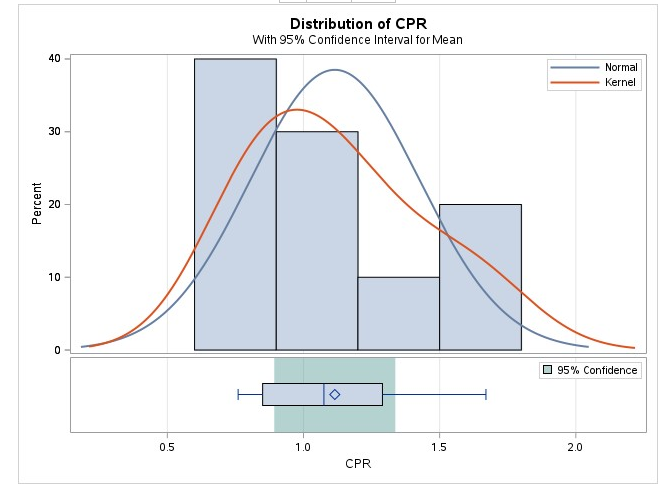

# SAS-project
## Problem Statement
The problem statement for the study is the need to accurately predict adverse perinatal outcomes in pregnancies complicated by pre-eclampsia. Pre-eclampsia is a serious condition that can pose risks to both the mother and the baby during pregnancy and childbirth. Therefore, identifying reliable markers for predicting adverse outcomes is crucial for timely intervention and improved maternal and fetal health

## Aim of the Study
The study aims to compare two ratios, the cerebroplacental ratio (CPR) and the umbilicocerebral ratio (UCR), in their ability to predict adverse perinatal outcomes in cases of pre-eclampsia. These ratios are likely indicators of fetal well-being and can provide valuable information for clinical decision-making

## OBjectives
- To determine the mean cerebroplacental ratio (CPR) in pregnancies complicated by pre-eclampsia.
- To determine the mean umbilicocerebral (UCR) ratio in pregnancies complicated by pre-eclampsia.
- To determine the relationship between cerebroplacental ratio (CPR) and adverse perinatal outcome.
- To determine the relationship between umbilicocerebral ratio (UCR) and adverse perinatal outcome.
- To compare the cerebroplacental ratio (CPR) and the umbilicocerebral ratio (UCR) in the prediction of adverse perinatal outcome.

## Outcome Measures
The primary outcome is to compare the diagnostic performance of CPR and UCR in detecting the presence of fetuses affected by a composite adverse outcome. The outcome measures include the APGAR scores (<7) of the babies in the first and fifth minute, birth asphyxia, low birth weight       at delivery,  admission to the special care baby unit, perinatal mortality.

# APGAR < 7 at 1st minute and CPR
Summary Statistics      |      Graphical representation
:----------------------:|:----------------------------------:
                        |                                    
                      

  ## Interpretation: 
  The statistical analysis was conducted using the TTEST Procedure. The t-test conducted on the dataset revealed a highly significant result (p < .0001), indicating a strong association between Apgar scores below 7 at the 1st minute and the need for CPR interventions. The mean CPR value of 1.1585 suggests that, on average, CPR was administered in these cases, with a notable standard deviation of 0.3055. 
  
## Conclusion:
This analysis underscores the critical nature of CPR interventions in cases where newborns exhibit lower Apgar scores shortly after birth. The statistical findings emphasize the importance of prompt and effective medical interventions in such scenarios to ensure the well-being and survival of newborns.
